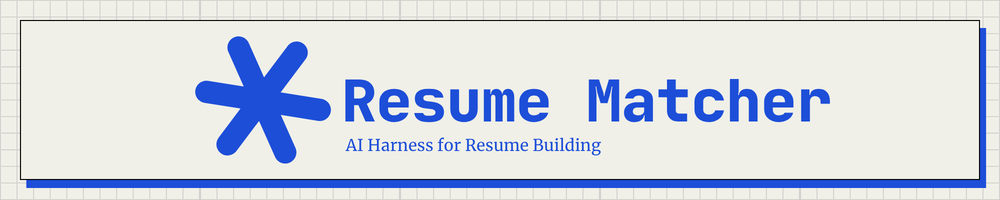
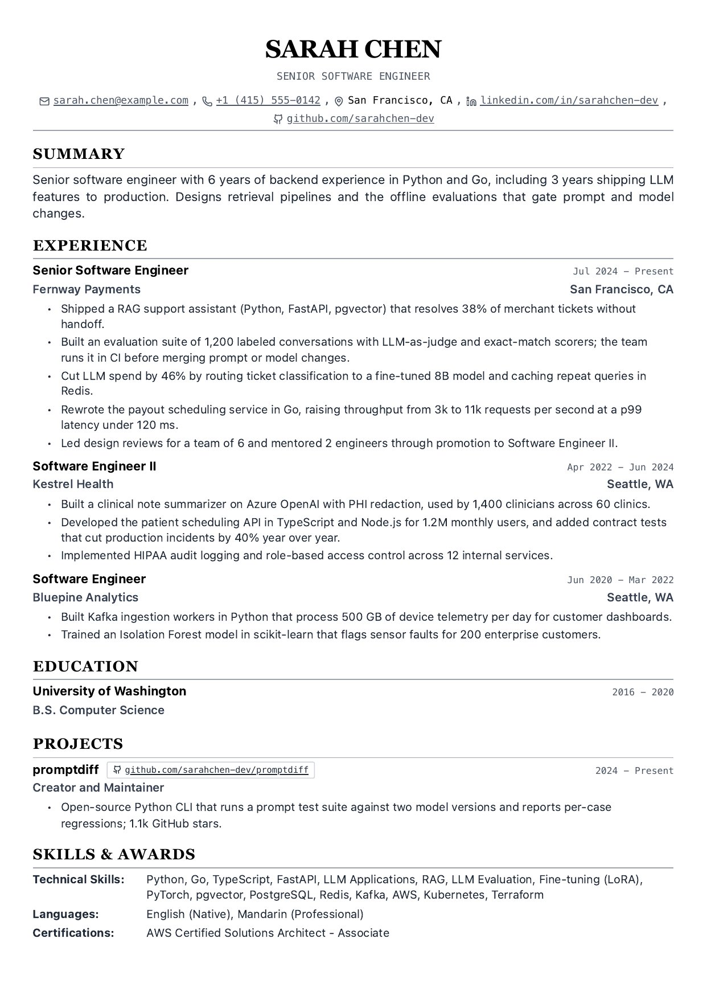
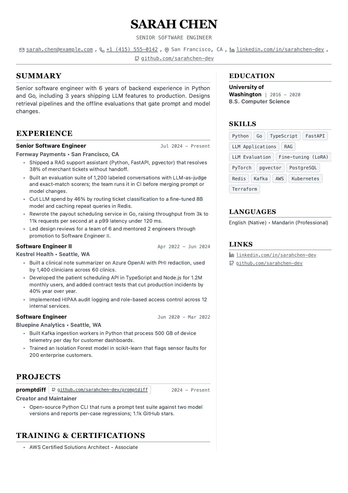
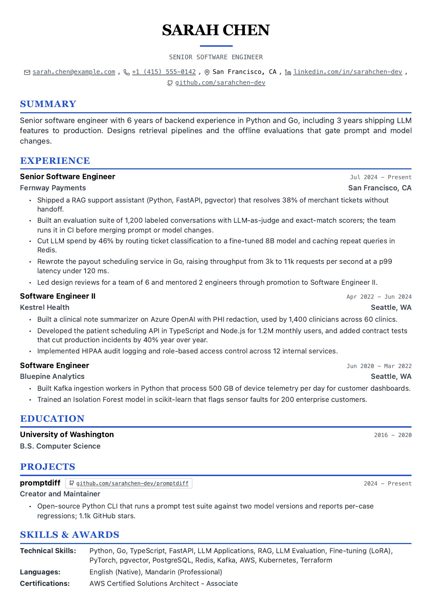
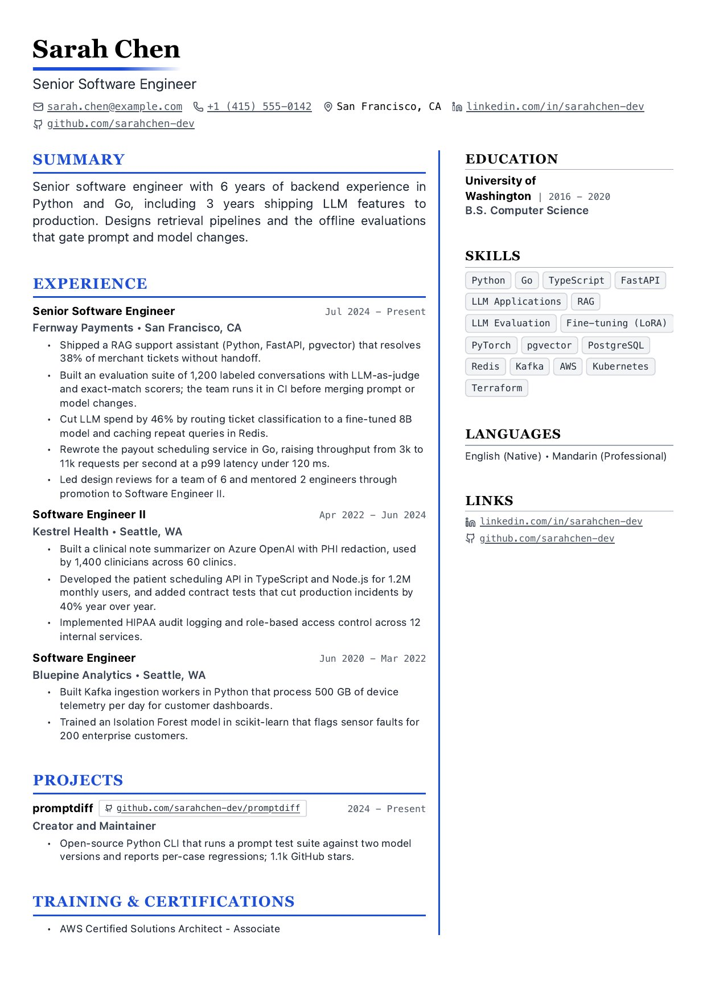
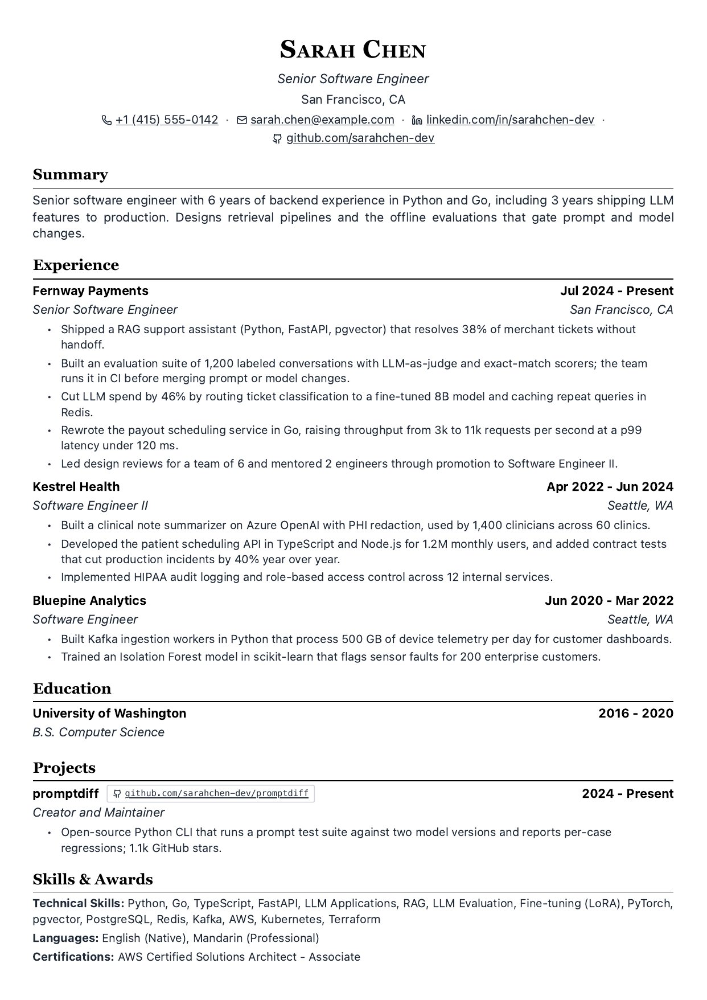
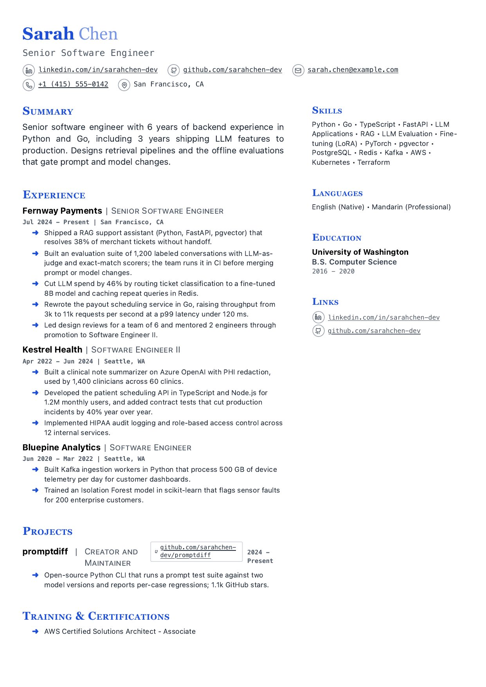
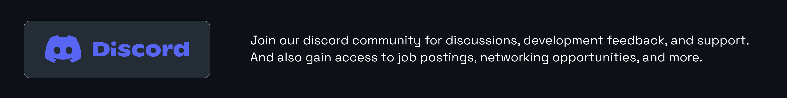
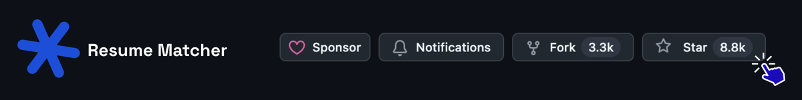

<div align="center">

[](https://www.resumematcher.fyi)

# Resume Matcher Templates

[𝙹𝚘𝚒𝚗 𝙳𝚒𝚜𝚌𝚘𝚛𝚍](https://dsc.gg/resume-matcher) ✦ [𝚆𝚎𝚋𝚜𝚒𝚝𝚎](https://resumematcher.fyi) ✦ [𝚁𝚎𝚜𝚞𝚖𝚎 𝙼𝚊𝚝𝚌𝚑𝚎𝚛](https://github.com/srbhr/Resume-Matcher) ✦ [𝚂𝚞𝚙𝚙𝚘𝚛𝚝](#support-resume-matcher) ✦ [𝙻𝚒𝚗𝚔𝚎𝚍𝙸𝚗](https://www.linkedin.com/company/resume-matcher/) ✦ [𝙲𝚛𝚎𝚊𝚝𝚘𝚛](https://srbhr.com)

Seven standalone, editable LaTeX resume templates adapted from
[Resume Matcher](https://github.com/srbhr/Resume-Matcher). Upload one template ZIP
to Overleaf, edit the sample content, and compile with **pdfLaTeX**.


[](https://dsc.gg/resume-matcher) [](https://resumematcher.fyi) [](https://github.com/srbhr/Resume-Matcher)

</div>

> \[!TIP]
>
> Want a resume tailored to each job description? [Resume Matcher](https://github.com/srbhr/Resume-Matcher)
> is the open-source AI app these designs come from. It builds a master resume,
> tailors it for each job, and exports PDFs. Each template here is a LaTeX
> adaptation of one of the app's built-in designs.

**Contents:** [Start here](#start-here) · [Choose a template](#choose-a-template) ·
[Use on Overleaf](#use-on-overleaf) · [Customize](#customize) ·
[Compile locally](#compile-locally) · [Troubleshooting](#troubleshooting) ·
[Maintain](#maintain-and-release-the-collection) · [License](#origin-and-license) ·
[Community](#stay-connected) · [Support](#support-resume-matcher)

> **Three files are required.** These are standalone projects that require
> `main.tex`, `resume.tex`, and `resume-matcher.sty` together. Copy-pasting a
> single `.tex` file into Overleaf will not work. Upload the complete ZIP for
> your chosen template.

Each project includes its own styling files. There are no dependencies on the
Resume Matcher app, no external font downloads, and no shell-escape requirement.
All names, employers, accomplishments, and contact details in the samples are fictional.
Every template is filled in with Sarah Chen, the fictional sample resume from the
Resume Matcher app, so you can edit a complete example. PDF author/title fields
also use the sample name. Social/profile links deliberately point to `example.com` placeholders;
replace both their labels and destinations before using the resume. Real place
names and technology names are used for context. Project attribution links refer
to the actual Resume Matcher repository. Each template's `preview.pdf` is the
app's own export and keeps its sample GitHub and LinkedIn profile links, which are
not `example.com` placeholders.

## Start here

Each template is an independent project. Its ZIP includes `main.tex`,
`resume.tex`, and the custom `.sty` file it needs. Keep those files together.
You do not need the Resume Matcher application, Python, or the other templates
when editing and compiling a single resume.

- **Use Overleaf:** [choose a template](#choose-a-template), upload the matching
  ZIP from its template folder, and follow [Use on Overleaf](#use-on-overleaf).
- **Work locally:** open a folder such as [`templates/clean/`](templates/clean/), edit `resume.tex`,
  and follow [Compile locally](#compile-locally).
- **Customize the appearance:** edit `main.tex` using the [settings reference](#customize).
- **Maintain this collection:** see [Maintain and release the collection](#maintain-and-release-the-collection).

```text
resume-matcher-templates/
├── README.md             Start here: usage and customization
├── templates/            Seven LaTeX projects, each with a README, preview, and Overleaf ZIP
├── dist/                 Complete collection ZIP
├── previews/             LaTeX-compiled PDF and PNG of every design (release builds)
├── shared/               Maintained source of the common styling package
├── scripts/              Optional release and verification tools for maintainers
├── assets/               README banners
├── VALIDATION.md         Compatibility checks and known limitations
├── LICENSE               Apache-2.0 license
└── NOTICE                Attribution
```

The previews are examples. Compile your edited source to produce your
own resume. All supplied applicant details are dummy data. See also
[VALIDATION.md](VALIDATION.md), [LICENSE](LICENSE), and [NOTICE](NOTICE).

## Choose a template

| Template | Layout and character | Overleaf project | Preview |
| -------- | -------------------- | ---------------- | ------- |
| [Swiss Single Column](templates/swiss-single/) | Centered serif name, black ruled headings, sans serif body | [Download ZIP](templates/swiss-single/resume-matcher-swiss-single.zip) | [JPG](templates/swiss-single/preview.jpg) · [PDF](templates/swiss-single/preview.pdf) |
| [Swiss Two Column](templates/swiss-two-column/) | Centered header, 65/35 columns, subtle vertical divider | [Download ZIP](templates/swiss-two-column/resume-matcher-swiss-two-column.zip) | [JPG](templates/swiss-two-column/preview.jpg) · [PDF](templates/swiss-two-column/preview.pdf) |
| [Modern](templates/modern/) | Centered name with accent underline, colored ruled headings | [Download ZIP](templates/modern/resume-matcher-modern.zip) | [JPG](templates/modern/preview.jpg) · [PDF](templates/modern/preview.pdf) |
| [Modern Two Column](templates/modern-two-column/) | Left-aligned header, 65/35 columns, accent divider | [Download ZIP](templates/modern-two-column/resume-matcher-modern-two-column.zip) | [JPG](templates/modern-two-column/preview.jpg) · [PDF](templates/modern-two-column/preview.pdf) |
| [LaTeX Classic](templates/latex/) | Serif type, small-caps name, company-first entries | [Download ZIP](templates/latex/resume-matcher-latex.zip) | [JPG](templates/latex/preview.jpg) · [PDF](templates/latex/preview.pdf) |
| [Clean](templates/clean/) | Sans serif type, light name, gray uppercase headings | [Download ZIP](templates/clean/resume-matcher-clean.zip) | [JPG](templates/clean/preview.jpg) · [PDF](templates/clean/preview.pdf) |
| [Vivid](templates/vivid/) | Two-tone name, 63/37 columns, colored small caps and arrow bullets | [Download ZIP](templates/vivid/resume-matcher-vivid.zip) | [JPG](templates/vivid/preview.jpg) · [PDF](templates/vivid/preview.pdf) |

<table>
  <tr>
    <td align="center"><a href="templates/swiss-single/"></a><br><a href="templates/swiss-single/"><b>Swiss Single Column</b></a><br><a href="templates/swiss-single/resume-matcher-swiss-single.zip">Overleaf ZIP</a> · <a href="templates/swiss-single/preview.pdf">PDF</a></td>
    <td align="center"><a href="templates/swiss-two-column/"></a><br><a href="templates/swiss-two-column/"><b>Swiss Two Column</b></a><br><a href="templates/swiss-two-column/resume-matcher-swiss-two-column.zip">Overleaf ZIP</a> · <a href="templates/swiss-two-column/preview.pdf">PDF</a></td>
    <td align="center"><a href="templates/modern/"></a><br><a href="templates/modern/"><b>Modern</b></a><br><a href="templates/modern/resume-matcher-modern.zip">Overleaf ZIP</a> · <a href="templates/modern/preview.pdf">PDF</a></td>
  </tr>
  <tr>
    <td align="center"><a href="templates/modern-two-column/"></a><br><a href="templates/modern-two-column/"><b>Modern Two Column</b></a><br><a href="templates/modern-two-column/resume-matcher-modern-two-column.zip">Overleaf ZIP</a> · <a href="templates/modern-two-column/preview.pdf">PDF</a></td>
    <td align="center"><a href="templates/latex/"></a><br><a href="templates/latex/"><b>LaTeX Classic</b></a><br><a href="templates/latex/resume-matcher-latex.zip">Overleaf ZIP</a> · <a href="templates/latex/preview.pdf">PDF</a></td>
    <td align="center"><a href="templates/clean/"></a><br><a href="templates/clean/"><b>Clean</b></a><br><a href="templates/clean/resume-matcher-clean.zip">Overleaf ZIP</a> · <a href="templates/clean/preview.pdf">PDF</a></td>
  </tr>
  <tr>
    <td align="center"><a href="templates/vivid/"></a><br><a href="templates/vivid/"><b>Vivid</b></a><br><a href="templates/vivid/resume-matcher-vivid.zip">Overleaf ZIP</a> · <a href="templates/vivid/preview.pdf">PDF</a></td>
  </tr>
</table>

Previews show each design as rendered by the Resume Matcher app with the Sarah Chen
sample. The LaTeX output keeps each design's visual character; line breaks and
spacing differ.

## Use on Overleaf

1. Download the ZIP for **one template** from the table above. On GitHub, open
   the ZIP's file page and use **Download raw file**.
2. In Overleaf, select **New project → Existing project (.zip)** and upload
   that ZIP.
3. Set **Main document** to `main.tex` and **Compiler** to **pdfLaTeX**.
4. Open `resume.tex` and replace the fictional name, experience, education,
   skills, and contact details. Update both the display text and destination of
   each link, including the `example.com` social-profile placeholders.
5. In `main.tex`, change the `pdftitle` and `pdfauthor` values in `\hypersetup`.
   Adjust the paper size and other formatting settings if needed.
6. Select **Recompile**, inspect every page, and use **Download PDF** to save
   your finished resume.

Use TeX Live 2025 or 2026 with **pdfLaTeX**; both versions passed the local
compatibility checks. The Overleaf service itself has not been exercised.

Overleaf documents this workflow in
[Uploading a project](https://docs.overleaf.com/managing-projects-and-files/uploading-a-project).
The individual template ZIPs contain `main.tex` at the root so there is one clear
main document. The collection ZIP is intended for the GitHub repository handoff;
upload a single template ZIP to Overleaf.

### Can I copy-paste a single `.tex` file?

No. In every template, `main.tex` loads the custom formatting from
`resume-matcher.sty` and the content from `resume.tex`. The `resume.tex` file
contains your details but has no document setup of its own. Neither `.tex`
file compiles by itself.

If you start with a blank Overleaf project, upload all three required files
into the project's root folder, then follow steps 3–6 above. You can also
create three files with those exact names and paste each file's matching
contents. Keep `main.tex` as the main document and edit your details in
`resume.tex`.

Replace both the visible labels and destinations of contact links, and update
`pdftitle` and `pdfauthor` in `main.tex`. Escape special characters in ordinary
text, for example `\&`, `\%`, and `\_`; see [Customize](#customize).
Your replacement content may need spacing adjustments or additional pages.

A single-file version would need the formatting and resume content embedded
in one complete document. Single-file exports are not included in this collection.

## What's in each project

```text
main.tex             Paper size, spacing, colors, icons, PDF metadata
resume.tex           Your resume content and custom-section examples
resume-matcher.sty   All template formatting commands, included locally
README.md            Editing and compilation instructions
LICENSE              Apache-2.0 license
NOTICE               Source attribution and adaptation notice
preview.jpg/.pdf     The design as rendered by the Resume Matcher app
resume-matcher-<template>.zip   Ready-to-upload Overleaf project
```

Start with the supplied examples. Move complete section blocks to reorder them,
or delete a heading with its content to hide a section. The two-column projects
place main content before `\resumesidebar` and supporting content after it.
Columns can continue onto additional pages. Entries reserve space for headings
and initial content, while long bullet lists may continue on the next page.

## Customize

| Setting              | Where to edit                                                                       |
| -------------------- | ----------------------------------------------------------------------------------- |
| A4 or US Letter      | `a4paper` / `letterpaper` in `main.tex`                                             |
| Body size            | `10pt`, `11pt`, or `12pt` in `\documentclass`                                       |
| Margins              | `\geometry{top=12mm,bottom=12mm,left=12mm,right=12mm}`                              |
| Section/item spacing | `\ResumeSectionGap` / `\ResumeItemGap`                                              |
| Line spacing         | `\ResumeLineSpread`                                                                 |
| Name size            | `\ResumeNameSize`                                                                   |
| Accent               | `\definecolor{ResumeAccent}{HTML}{1D4ED8}`; Modern and Vivid designs                |
| Contact icons        | `\ResumeIconstrue` / `\ResumeIconsfalse`                                            |
| Column split         | `\ResumeColumnRatio`; 0.65 normally, 0.63 for Vivid                                 |
| Heading font         | `\renewcommand{\ResumeHeadingFont}{\rmfamily}` (serif), `\sffamily`, or `\ttfamily` |
| Body font            | `\renewcommand{\familydefault}{\rmdefault}`, `\sfdefault`, or `\ttdefault`          |

For compact spacing, reduce the two gap lengths and line spread. The samples use
12 mm margins for comfortable editing; the app's browser defaults are denser.
TeX Gyre Termes, Heros, and Cursor replace the browser's serif, sans serif, and
monospace font stacks. The designs preserve their visual character, not exact
browser line breaks. The Modern Two Column name underline is a solid accent rule
instead of a CSS gradient. Icons are off by default, as in the app.

### Content commands

```tex
\resumesection{Experience}
\experience{Company}{Role}{Location}{2023 -- Present}
\begin{highlights}
  \item Improved reliability by \textbf{35\%}.
  \plainitem\textit{An unbulleted description or continuation line.}
\end{highlights}

\project{Project name}{Role or technologies}{2024}{https://example.com}
\education{University}{Degree}{City}{2017 -- 2021}
\skillgroup{Languages}{Python, TypeScript, SQL}
```

Custom sections support paragraphs, entry lists (publications, research), or bullet
lists. Commented examples are included in every `resume.tex`.
Leave optional entry arguments empty with `{}`. To remove a contact, delete its
whole `\contact` command and one adjoining `\contactsep`. To hide the location,
clear the header's location argument and remove its contact command if present.
Rename headings directly to translate them.
The style also includes `\skilltag{Python}` for short boxed skill labels.

Escape `&`, `%`, `$`, `#`, `_`, `{`, and `}` as `\&`, `\%`, `\$`, `\#`, `\_`,
`\{`, and `\}`. Use `\textbackslash{}`, `\textasciitilde{}`, and
`\textasciicircum{}` for the other special characters. Use `\url{...}` for URLs
or `\href{...}{short label}` for readable links. Accented Latin text is supported
by the supplied pdfLaTeX setup. CJK, Arabic, and other scripts require additional
language/font configuration; this collection does not promise automatic multilingual
conversion from the app.

The PDF contains selectable text and real hyperlinks. Two-column extraction order
depends on the reader/parser; test with your target system. No ATS score or universal
parsing compatibility is implied.

## Compile locally

Install TeX Live or MiKTeX, or follow the [TinyTeX steps](#no-tex-installed-use-tinytex) below. From this collection's root, choose a template:

```sh
cd templates/clean
```

Replace `clean` with [`swiss-single`](templates/swiss-single/), [`swiss-two-column`](templates/swiss-two-column/), [`modern`](templates/modern/), [`modern-two-column`](templates/modern-two-column/), [`latex`](templates/latex/), or [`vivid`](templates/vivid/) as desired. Edit `resume.tex` and the
PDF metadata in `main.tex`, then compile from that same template folder:

```sh
pdflatex -interaction=nonstopmode -halt-on-error main.tex
pdflatex -interaction=nonstopmode -halt-on-error main.tex
```

The resulting file is `main.pdf` in that template folder. Re-run these commands
after editing. Alternatively, run `latexmk -pdf main.tex`.

Standard TeX Live packages used here include
`lm` (Latin Modern math), `tex-gyre`, `geometry`, `xcolor`, `tools` (tabularx), `enumitem`, `needspace`,
`paracol`, `microtype`, `fontawesome5`, `xurl`, `hyperref`, and `iftex`.
Minimal TeX installations may need these installed with their package manager.
Overleaf supplies these packages. Once installed, compilation needs no network access.

### No TeX installed? Use TinyTeX

[TinyTeX](https://yihui.org/tinytex/) is a small TeX Live distribution that
installs into your user folder without administrator rights. Compiling locally
keeps your resume on your own computer; nothing is uploaded.

1. Install TinyTeX.
   - macOS or Linux:

     ```sh
     curl -sL "https://yihui.org/tinytex/install-bin-unix.sh" | sh
     ```

   - Windows: download and run
     [`install-bin-windows.bat`](https://yihui.org/tinytex/install-bin-windows.bat).

2. Open a new terminal so `pdflatex` and `tlmgr` are on your `PATH`, then
   install the packages listed above:

   ```sh
   tlmgr install lm tex-gyre geometry xcolor tools enumitem needspace paracol microtype fontawesome5 xurl hyperref iftex
   ```

3. Compile from a template folder with the `pdflatex` commands above.

If compilation stops with `File '<name>.sty' not found`, install the package
that provides it with `tlmgr install <package>` and compile again.

## Troubleshooting

| Problem                                        | What to do                                                                                                                      |
| ---------------------------------------------- | ------------------------------------------------------------------------------------------------------------------------------- |
| `resume-matcher.sty` or `resume.tex` not found | Upload the complete individual template ZIP, or compile from the folder containing all three source files.                      |
| Overleaf compiles the wrong document           | Set **Main document** to `main.tex`; upload one template ZIP, not the whole collection ZIP.                                     |
| A standard package is missing locally          | Install the packages listed above using your TeX distribution's package manager, or use Overleaf.                               |
| Errors after pasting text                      | Check special characters such as `%`, `&`, `_`, and `$`; use the escaping examples in [Customize](#customize).                  |
| A contact still opens an example page          | Replace the URL argument as well as the visible contact label in `resume.tex`.                                                  |
| PDF properties still say Sarah Chen            | Update `pdftitle` and `pdfauthor` in `main.tex`, then recompile.                                                                |
| Content runs onto another page                 | Shorten the content or adjust spacing/margins in `main.tex`. Multi-page resumes are supported.                                  |
| Non-Latin characters fail to compile           | The included setup supports accented Latin text. CJK and right-to-left scripts need additional language and font configuration. |

## Maintain and release the collection

The GitHub repository is
[resume-matcher/resume-matcher-templates](https://github.com/resume-matcher/resume-matcher-templates)
and is private. Download links require access to that repository.
Keep its `.gitignore`, license, notices, and complete directory structure.
Template download and preview links use relative paths. An Overleaf gallery
listing has not been published; upload an individual template ZIP to your own
Overleaf project using the instructions above.

The copy in `shared/resume-matcher.sty` is the maintained source. Each template
has a checked-in copy so it works independently. Edit the shared version and run:

```sh
python3 scripts/release.py --sync-only
```

To rebuild previews and release ZIPs, install Python 3.10+, pdfLaTeX, and Poppler,
then run:

```sh
python3 scripts/release.py
```

For the wider compilation checks (A4, Letter, contact icons, location editing,
accented text, empty optional fields, longer names, URL query/fragment targets,
and multi-page content in all seven styles), run:

```sh
python3 scripts/verify.py
```

This uses Poppler's `pdfinfo` and `pdftotext` as well as pdfLaTeX. Scratch files
and a machine-readable report go into the ignored `_build/` directory.
Use `--engine /path/to/pdflatex --output-dir /path/to/test-output` to test a
different TeX Live installation without overwriting another test run.
See [VALIDATION.md](VALIDATION.md) for the delivered version's results and limits.

The release script copies the styling into all projects, creates an upload ZIP in each
template folder, extracts each ZIP to a fresh temporary directory, compiles it twice with shell
escape disabled, rejects overflow/missing-glyph/font warnings, and renders preview
images. It also creates `dist/resume-matcher-templates.zip` containing the
repository sources, previews, and all seven individual Overleaf ZIPs.
The per-template `preview.jpg` and `preview.pdf` files are exports from the Resume
Matcher app and are copied in by hand, not generated by this script. The handoff
archive excludes itself and local build scratch files. Its download and preview
links work immediately after the contents are copied into a new repository.

## Origin and license

Adapted from the seven templates under
`apps/frontend/components/resume/` in Resume Matcher, release **1.3 Crescendolls**,
commit `0932418c`. The template IDs remain the same as the app's IDs.

Apache License 2.0, matching the upstream repository. The included notices identify
these files as LaTeX adaptations. Vivid follows Resume Matcher's existing visual
design; no Awesome-CV class or source code is included. TeX Gyre and Font Awesome
are dependencies supplied by TeX Live and retain their own licenses.

## Stay connected

[](https://dsc.gg/resume-matcher)

Join the [Discord](https://dsc.gg/resume-matcher) to share templates, request
designs, report issues, and get community support.

[](https://github.com/srbhr/Resume-Matcher)

Star [Resume Matcher](https://github.com/srbhr/Resume-Matcher) to support
development and get notified of new releases.

<a id="support-resume-matcher"></a>

## Support Resume Matcher


Resume Matcher and these templates are free and open source, kept alive by
sponsors and backers. If they help you, please consider supporting development.

<div align="center">

[](https://github.com/sponsors/srbhr) [](https://www.buymeacoffee.com/srbhr)

</div>

See the [sponsors](https://github.com/srbhr/Resume-Matcher#sponsors) backing
Resume Matcher and the [Sponsorship Guide](https://resumematcher.fyi/docs/sponsoring)
for tiers.

## Creator's note

[](https://srbhr.com)

Thank you for checking out the Resume Matcher templates. If you want to connect,
collaborate, or just say hi, feel free to reach out!
~ **Saurabh Rai** ✨

- Website: [srbhr.com](https://srbhr.com)
- LinkedIn: [linkedin.com/in/srbhr](https://www.linkedin.com/in/srbhr/)
- Twitter/X: [@srbhrai](https://twitter.com/srbhrai)
- GitHub: [srbhr](https://github.com/srbhr)
