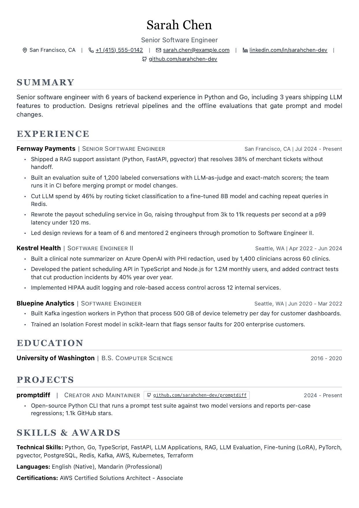

# Resume Matcher: Clean

A standalone LaTeX adaptation of Resume Matcher's `clean` template, filled in
with Sarah Chen, the fictional sample resume from the Resume Matcher app. Edit
`resume.tex` to make it yours. All names, employers, achievements, and contact
details are fictional. Social/profile links point to `example.com` placeholders.
Replace their targets and labels before using the resume.

[](preview.pdf)

The preview shows this design as rendered by the Resume Matcher app
([PDF](preview.pdf)). The LaTeX output keeps the design's visual character, but
line breaks and spacing differ. The preview PDF keeps the app's own sample
profile links, which are not `example.com` placeholders.

**Overleaf upload:** [`resume-matcher-clean.zip`](./resume-matcher-clean.zip) contains `main.tex`, `resume.tex`,
`resume-matcher.sty`, and this project's README, LICENSE, and NOTICE.

## Files

| File | Purpose |
| ---- | ------- |
| `resume.tex` | Resume content: edit this |
| `main.tex` | Paper size, spacing, colors, icons, PDF metadata |
| `resume-matcher.sty` | Template formatting commands |
| `resume-matcher-clean.zip` | Ready-to-upload Overleaf project |
| `preview.jpg`, `preview.pdf` | App rendering of this design |
| `LICENSE`, `NOTICE` | Apache-2.0 license and attribution |

## Overleaf

> **Three files are required.** This is a standalone project that requires
> `main.tex`, `resume.tex`, and `resume-matcher.sty` together. Copy-pasting a
> single `.tex` file into Overleaf will not work. Upload the complete template
> ZIP, [`resume-matcher-clean.zip`](./resume-matcher-clean.zip), included in this folder.

1. In Overleaf, select **New project → Existing project (.zip)** and upload
   [`resume-matcher-clean.zip`](./resume-matcher-clean.zip) from this folder.
2. Set the main document to `main.tex` and the compiler to **pdfLaTeX**.
3. Open `resume.tex` and replace the sample name, experience, education, skills,
   and contact details. Update both the visible labels and destinations of links.
4. In `main.tex`, update `pdftitle` and `pdfauthor` to match your details.
5. Click **Recompile**, inspect every page, and use **Download PDF** to save
   your resume.

Keep the three required files together at the project's root. If starting with
an empty project, upload all three files, or create files with those exact names
and paste each file's matching contents. Neither `.tex` file compiles by itself:
`main.tex` loads the style and resume content, while `resume.tex` has no document
setup of its own. Single-file exports are not included.

No Resume Matcher installation, external font files, shell escape, or custom
build step is required. The packages and fonts are supplied by TeX Live on Overleaf.

## Local compilation

With a TeX Live or MiKTeX installation:

```sh
pdflatex -interaction=nonstopmode -halt-on-error main.tex
pdflatex -interaction=nonstopmode -halt-on-error main.tex
```

Alternatively, run `latexmk -pdf main.tex`. The output is `main.pdf`.

### No TeX installed? Use TinyTeX

[TinyTeX](https://yihui.org/tinytex/) is a small TeX Live distribution that
installs into your user folder without administrator rights. Compiling locally
keeps your resume on your own computer; nothing is uploaded.

1. Install TinyTeX.
   - macOS or Linux:

     ```sh
     curl -sL "https://yihui.org/tinytex/install-bin-unix.sh" | sh
     ```

   - Windows: download and run
     [`install-bin-windows.bat`](https://yihui.org/tinytex/install-bin-windows.bat).

2. Open a new terminal so `pdflatex` and `tlmgr` are on your `PATH`, then
   install the packages these templates use:

   ```sh
   tlmgr install lm tex-gyre geometry xcolor tools enumitem needspace paracol microtype fontawesome5 xurl hyperref iftex
   ```

3. Run the `pdflatex` commands above from the folder containing `main.tex`.

If compilation stops with `File '<name>.sty' not found`, install the package
that provides it with `tlmgr install <package>` and compile again.

## Editing

- `resume.tex`: name, title, contacts, summary, experience, projects, education,
  skills, languages, certifications, and commented custom-section examples.
- `main.tex`: A4/Letter paper, margins, spacing, name size, icons, accent color,
  and PDF title/author. Update the PDF metadata when replacing the sample name.
- `resume-matcher.sty`: included formatting commands. Usually no edits are needed.

Use `\item` for bullets and `\plainitem` for unbulleted rows inside `highlights`.
Escape special characters: `\&`, `\%`, `\$`, `\#`, `\_`, `\{`, `\}`.
Write backslashes as `\textbackslash{}`, tildes as `\textasciitilde{}`, and
carets as `\textasciicircum{}`. Normal accented Latin letters work with pdfLaTeX;
other scripts need appropriate language/font setup and are not configured here.

Move entire section blocks in `resume.tex` to reorder them. Delete a heading together with its content to hide a section.

Copy a `project` block for publications or research. A `resumesection` followed
by plain text or a `highlights` list creates other custom sections.
Omit optional entry fields by leaving their braces empty, for example `{}`.
To remove a contact, delete its whole `\contact` command and one adjoining
`\contactsep`. To hide location, clear the header location argument and remove
its contact command if present.
Use short display labels with `\href{long URL}{label}` for long contact URLs.

For US Letter, change `a4paper` to `letterpaper` in `main.tex`. To fit more text,
edit the content first, then adjust spacing or margins; avoid making the text
uncomfortably small. Long resumes flow onto additional pages.

This preserves the web template's visual character using TeX Live typefaces;
it is not a pixel-identical browser PDF. PDF text is selectable, but extraction
order in columns varies by parser and no ATS compatibility guarantee is made.

## License and credits

Apache-2.0. Keep `LICENSE` and `NOTICE` when redistributing the template source.
Adapted from [Resume Matcher](https://github.com/srbhr/Resume-Matcher),
release 1.3 Crescendolls (`0932418c`). Font Awesome and TeX Gyre fonts are
provided by the TeX installation under their own licenses; their files are not
redistributed in this project.

[Overleaf upload instructions](https://docs.overleaf.com/managing-projects-and-files/uploading-a-project)
